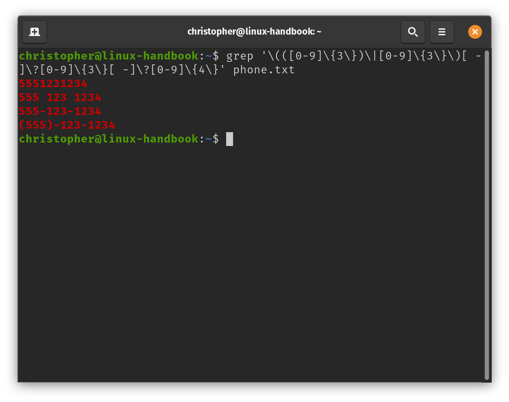
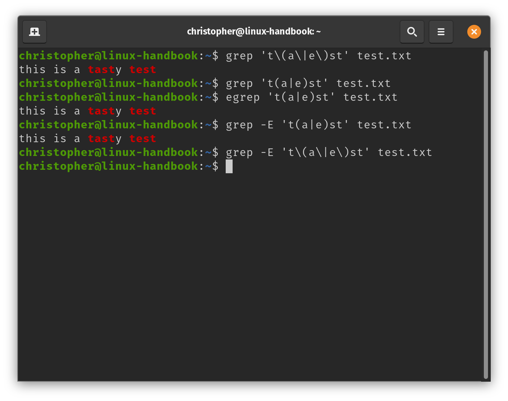
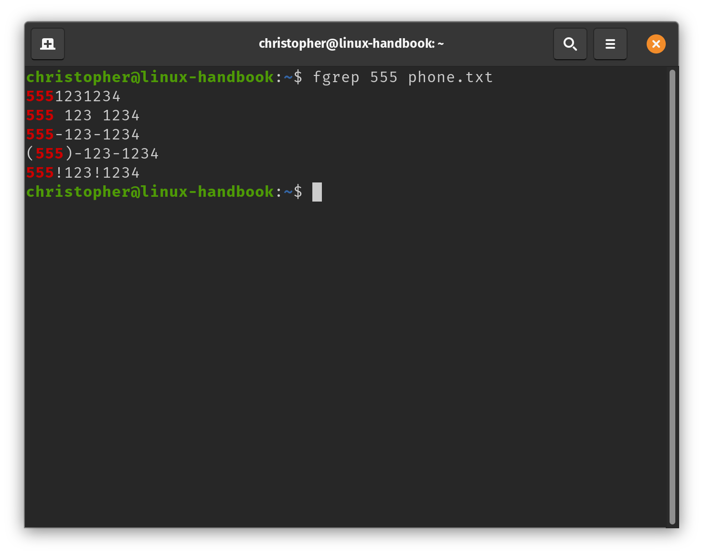

# Grep, Egrep (Extended), and Fgrep (Fixed)
The primary purpose of this article is to explain the primary differences between `grep`, `egrep`, and `fgrep`. 

Before I get into that, I will provide a little background on grep. 

Then, I will define what a regular expression is and demonstrate how they're used in grep.

After that, I will use a few more examples to highlight the differences between these grep variants and their respective uses.

If you're looking to learn more, I would also suggest taking a look at our article [10 Practical Grep Command Examples for Developers](https://linuxhandbook.com/grep-command-examples/). 

# Background on Grep

## Why grep?
With its unusual name, you may have guessed that grep is an acronym. This is at least partially true, but it depends on who you ask.

According to reputable sources, the name is actually derived from a command in a unix text editor called `ed`. In which, the input `g/re/p` performed a global (g) search for a regular expression (re), and subsequently printed (p) any matching lines. 

This is the official narrative, but you may also see it described as Global Regular Expression (Processor `|` Parser `|` Printer). Truthfully, it does all of that.

## The Story Behind Grep
[Ken Thompson](https://en.wikipedia.org/wiki/Ken_Thompson) has made some incredible contributions to computer science. He helped create Unix, popularized its modular approach, and wrote many of its programs including grep.

Thompson built grep to assist one of his colleagues at Bell Labs. This scientist's goal was to examine linguistic patterns to  identify the authors of the Federalist Papers. This extensive body of work is a collection of 85 anonymous articles and essays drafted in defense of the United States Constitution. 

The original unix text editor, `ed`, (also created by Thompson) wasn't capable of searching such a large body of text given the hardware limitations of the time. So, Thompson transformed the search feature into its own utility. 

If you think about it, that means Alexander Hamilton technically helped create grep. Feel free to share this fun fact with your friends at your [Hamilton](https://www.disneyplus.com/welcome/hamilton) watch party. 🤓

## What is a Regular Expression?
A regular expression (or regex) can be thought of as kind of like a search query. Regular expressions are used to identify, match, or otherwise manage text. 

Regex is capable of much more than keyword searches, though. It can be used to find any kind of pattern imaginable. Patterns can be found easier by using meta-characters. These special characters that make this search tool much more powerful.

It should be noted that grep is just one tool that uses regex. There are similar capabilities across the range of tools, but meta characters and syntax can vary. This means it's important to know the rules for your particular regex processor. 

# A Practical Example of Grep
## Use Grep to Match Phone Numbers
This tool can be intimidating to newbies and experienced Linux users alike. Unfortunately, even a relatively simple pattern like a phone number can result in a "scary" looking regex string. 

I want to reassure you that there is no need to panic when you see expressions like this. Once you become familiar with the basics of regex, it can open up a new world of possibilities for your computing.

##### Cultural note: This example uses US (NANP) conventions for phone numbers. These are 10-digit IDs that are broken up into an area code (3 digits), and a unique 7 digit combination where the first 3 digits correspond to a central telecom office (known as a prefix) and the last 4 are called the line number. So the pattern is AAA-PPP-LLLL. 

I've created a file called `phone.txt` and written down 4 common variations of the same phone number. We are going to use grep to recognize the number pattern regardless of the format. 

I've also added one line that will not conform to the expression to use as a control. The final line `555!123!1234` is not a standard phone number pattern, and will not be returned by our grep expression.

Contents of `phone.txt`:
```
christopher@linux-handbook:~$ cat phone.txt 
5551231234
555 123 1234
555-123-1234
(555)-123-1234
555!123!1234
```
In order to "grep" our phone numbers, we're going to write our regex using meta-characters to isolate the relevant data and ignore what we don't need.

Our complete command is going to look like this:
```
christopher@linux-handbook:~$ grep '\(([0-9]\{3\})\|[0-9]\{3\}\)[ -]\?[0-9]\{3\}[ -]\?[0-9]\{4\}' phone.txt
```
Looks a little intense, right? Let's break it down into chunks to get a better idea of what is happening. 

## One Segment at a Time 

First let's separate the section of the RegEx that looks for the "area code" in the phone number. A similar pattern is partially repeated to get the rest of the digits, as well. It's important to note that the area code is sometimes encapsulated in parenthesis, so we need to account for that with our expression. 

1. The logic of our entire area code section is encapsulated in an escaped set of round braces. You can see that our code starts with `\(` and ends with `\)`.

2. When we use the square brackets `[0-9]`, we're letting grep know that we're looking for a number between 0 and 9. Similarly, we could use `[a-z]` to match letters of the alphabet.

3. The number in the curly brackets `{3\}`, means that the item in the square braces is matched exactly three times. 


Still confused? Don't get stressed out. We're going to look at this example in several ways so that you feel confident moving forward. 

Lets try looking at the logic of the area code section in pseudo-code. I've isolated each segment of the expression into it's own code block.

### Pseudo-code of the Area Code RegEx
```
\(      
```

```
(3-Digit Number)
```
```
|     
```
``` 
3-Digit Number 
``` 
``` 
\) 
```
Hopefully seeing it like this makes the regex more straightforward. In plain language we're looking for 3 digit numbers. Each digit could be 0-9, and there may **or** may not be parenthesis around the area code. 

Then, there's this weird bit at the end of our first section. 
```
[ -]\?
```
What does it mean? The `\?` symbol means "match zero or one of the preceding character". Here, that's referring to what is in our square brackets `[ -]`. In other words, there may or may not be a hyphen that follows the digits.


### Area Code
Now let's re-build the same block with the actual code. Then, we'll add the other parts of the expression.

```
\(
```
```
([0-9]\{3\}) 
```
```
|      
```
```
[0-9]\{3\}
```
```
\)
```
```
[ -]\?
```

### Prefix
To complete the phone number pattern, we can just re-purpose some of our existing code.
```
[0-9]\{3\}[ -]\?
```
We do not have to be concerned about the parenthesis surrounding the prefix, but we still may or may not have a `-` between the prefix and the line digits of the phone number.

### Line Numbers
The last section of the phone number does not require us to look for any other characters, but we need to update the expression to reflect the extra digit. 

```
[0-9]\{4\}
```
That's it. Now let's make sure that the expression is contained in quotes to minimize unexpected behaviors.

#### Here's the complete expression again
```
christopher@linux-handbook:~$ grep '\(([0-9]\{3\})\|[0-9]\{3\}\)[ -]\?[0-9]\{3\}[ -]\?[0-9]\{4\}' phone.txt
```



## Success!
You can see that the results are highlighted in color. This may not be the default behavior on your Linux distribution. 

### Bonus Tip
If you'd like your results to be highlighted, you could add `--color=auto` to your command. You could also add this to your shell profile as an alias so that every time you type `grep` it runs as a `grep --color=auto`.


# Comparison of grep, egrep, and fgrep
## Overview
Okay, I hope you have a better understanding of grep and regex. Now, let's look at a couple of grep's most popular variants: egrep and fgrep. The `e` stands for extended and the `f` stands for fixed or fake... that will make more sense soon. 

Although, you may still see `egrep` and `fgrep` in the wild, their status is deprecated. Many systems still include the binaries for these variants. However, it is now the POSIX standard to use standard grep with special option flags (`-E` or `-F`). These flags help standard grep emulate the functionality of each respective command.

## Examples 

I have created another short text file to demonstrate the differences between these variants. 

```
christopher@linux-handbook:~$ cat test.txt 
this is a tasty test
```

## **Standard** Grep
This is the standard version of grep designed for searching patterns using basic regular expressions. Using grep requires escaping  meta-characters to generate the expected behavior. 

We saw this in action in the phone number example. We had to escape certain characters using the `\` symbol.

### Example:
For these examples, I will show the different commands for each version, and then I will include a screenshot that 
```
christopher@linux-handbook:~$ grep 't\(a\|e\)st' test.txt
```

## **Extended Grep**: Egrep or grep -E 
Egrep was created to provide **extended** support for meta-characters. This means that it escapes these special characters by default. This saves time and generally makes an expression easier to read. 

The command we used above can be re-written as the much more legible: 

```
christopher@linux-handbook:~$ egrep 't(a|e)st' test.txt
```

The egrep binary does not consistently support the `{` character. This can result in unexpected behaviors. Some versions of egrep allow them to be interpreted properly as literal characters if escaped (`\{`). However, the best practice for matching a literal `{` is to enclose in square brackets `[{]`. 



Comparison of Expressions using Grep and Egrep on test.txt

## **Fixed Grep**: Fgrep or grep -F
Software professionals know that even as computational capability has increased profoundly, optimization can never be ignored. Grep is a very powerful tool, but it can sometimes use system resources unnecessarily. 

This is where the idea of fixed grep came from. This software is ideal for use cases where you need to match an exact string. It does not feature the powerful expression tools of the other grep variants. That weakness is actually it's super power. This makes the tool much faster.




# Conclusion
Did you enjoy our comparison  `grep, egrep, and fgrep` commands? I hope all of these tips taught you something new. If you like this guide, please share it on social media. If you have any comments or questions, leave them below. If you have any suggestions for topics you'd like to see covered, feel free to leave those as well. Thanks for reading. 
