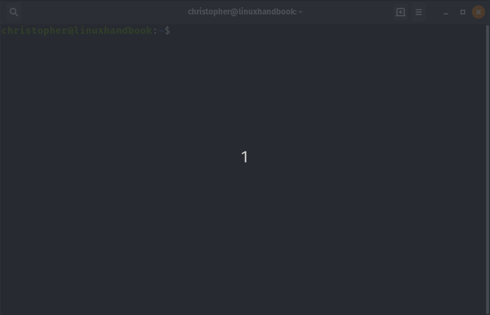

# Jobs Command in Linux
The jobs command allows the user to directly interact with processes in the current shell. Jobs have three possible states in Linux: foreground, background, and stopped. What does that mean? I'll explain more in a bit. First let's look at some of the tools built into the Jobs command.

# Syntax 
Job Control has several different functions. Each can be run independently. Here is a table of the commands related to Job Control.

| Command | Description | 
|--|--|
| jobs | Lists jobs in current shell|
| bg %n | Send process to background |
| fg %n | Bring process to foreground|

In the table, `n` represents the number of the corresponding job ID. 

## Understanding Job Control
What exactly is a job anyway? Jobs, processes, and tasks are words that are often used interchangeably. 

There are actually some small differences that are important for clarity.

The difference can be boiled down to which entity is handling the tasks. Users own jobs, while the kernel owns processes. 

In Linux, a job can be a single process or it may have many child or sub-processes. An example of this may be a job that features several piped commands like this:

```
cat file1 | sort | uniq
```

In personal computing, the operating system handles most processes automatically. This is usually optimized for the needs of the system or the priority given to a certain task. This processes are completed by the kernel and are given a process ID (PID). 

## Controlling Jobs
When we open a new shell, we have the power to create our own jobs. In fact, this is what happens when you enter any command (or series of commands) into a terminal. 

At the user level --from a shell, we can manually send jobs to work in the background, bring them to the foreground, or suspend them(ctrl+z).

So, let's put what we have learned so far into practice with a few examples. 

## Example 1: Send Jobs to Background
Sending a job to work in the background is easy. We just need to append our command with an `&` ampersand symbol.

```
christopher@linuxhandbook:~$ nano Linux_Handbook &
[1] 2860

```
You can see this command returns the job number in the brackets. The following number is the process ID used by the kernel. 

## Example 2: View Jobs
If you tried to type the`jobs` command you might been confused that nothing seemed to happen. This is because there were no active jobs in the shell. Now that we have a job running we can run the `jobs` command succesfully.

```
christopher@linuxhandbook:~$ jobs
[1]+  Stopped                 nano Linux_Handbook

```
The PID number isn't listed here, but we don't need it. We control jobs using the user/shell-specific job ID.

## Example 3: Bring Jobs to Foreground
We can use that Job ID to bring our instance of nano to the foreground.

```
christopher@linuxhandbook:~$ fg %1
``` 

If you have been following along, this should bring you into nano with our file named Linux Handbook. 

## Example 4: Stop a Job with ctrl+z
We can stop open jobs by using ctrl+z. Here's a screen shot that shows how to use this with `top`.



In the screencast, you can watch me open top, use ctrl+z to suspend it, view it in my jobs list, and then bring it back to the foreground before closing it.

## Example 5: Run Background Jobs Using `bg`

While you can send jobs to the background with the `&` symbol, it's always good to have an alternative. In the screencast, you watched me stop the job using ctrl+z. I brought the job back to the shell and the foreground with the `fg %n` command. We can do the same thing using `bg`. 

I am going to use a GUI application just to switch things up. You may have noticed in the past that when you open a GUI from the terminal that if you close the terminal, the GUI will close too. Hopefully this article has clarified for you why that happens. 

So, let's use `gedit`. I'm going to do the following: 
* Start Gedit
* Return to the Shell and Ctrl+z
* Send it to the Background to Run using bg
* Check my Jobs List to Verify it is Running
* Return to Foreground and Send a system interrupt using Ctrl+c to Terminate it

```
christopher@linuxhandbook:~$ gedit
^Z
[1]+  Stopped                 gedit
christopher@linuxhandbook:~$ bg %1
[1]+ gedit &
christopher@linuxhandbook:~$ jobs
[1]+  Stopped                 gedit
christopher@linuxhandbook:~$ fg %1
gedit
^C
```

## Bonus

Many of us are used to using ctrl+c to terminate jobs in a shell. There is another way to do this that incorporating your new job control knowledge. 

```
christopher@linuxhandbook:~$ fg %1
gedit
^Z
[1]+  Stopped                 gedit
christopher@linuxhandbook:~$ kill %1
```
That's right, the kill command can be used along with the job id to terminate a job also. 

# Conclusion
Learning the Linux command line brings us closer to the inner-workings of our favorite operating system. Learning jobs control gives us the ability to handle multiple jobs at once.

I hope that you found something new to explore with this article. If you enjoyed it, please let us know in the comments section below or use the links to share on social media. 

